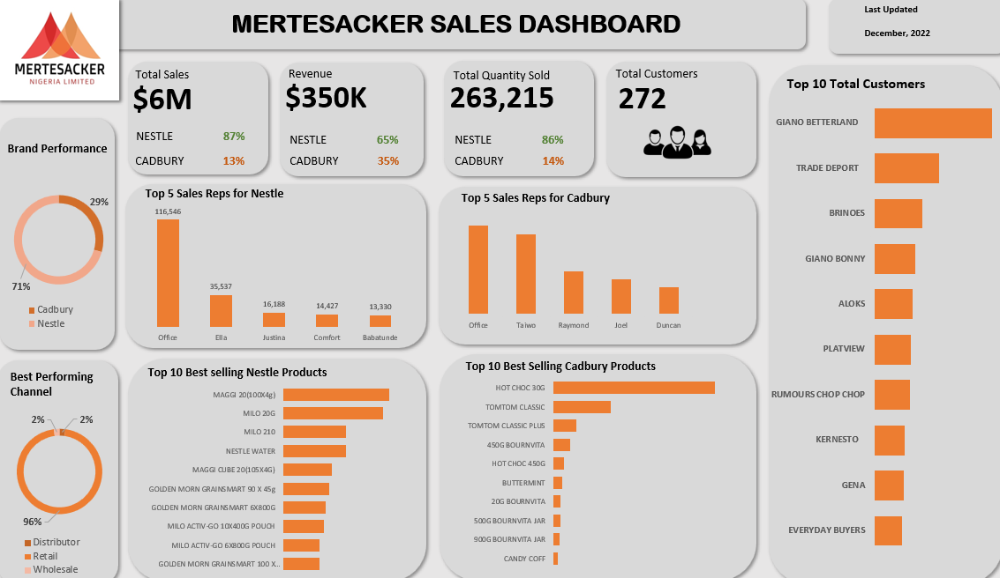

# Mertesacker-Nig-Ltd-Sales-Analysis: A Guide through my Sales Analysis Project

## Introduction
Mertesacker Nigeria Limited is one of the biggest distribution companies in Port Harcoourt.
They are a major consumer goods distributor for Nestle and Cadbury.
For a few years now, Mertesacker Nigeria Limited has been delighting Retailers and Consumers with consumer goods through their top notch service.
Mertesacker's vision is to endeavour to be the distribution choice for both Multi-nationals and resellers across the world.

With one of the best sales force, Mertesacker has been rewarded as the best sales distributor in the Southern Region for Nestle.

This is a real life Data Analysis sales project. I am to provide valuable insights and create a good visualization using the data given to me. It is a data from the half of 2022 (June, 2022) to end of 2022 (December, 2022)
This project, including the visualization was achieved using just Microsoft Excel.

## The Process
Data analysis has a pattern which is followed in order to achieve your desired result. Here, I shared the process I used Personally for this Project.

This is how I guided myself all through the project which took a lot of time.

## Step 1: Objective; Knowing what to find, your aim or goal of the Project

As a sales company, the goal of the Analysis is to provide insights and give recommendations using my analyzed data and which will also be used in providing Data-decision making. Knowing what to find will give me an understanding of the insights to provide. 
A few of the objectives include knowing the best and worse sales reps, knowing the best performing products, identifying the best customers Diamond Customers) etc. 

## Step 2: Collecting the Data

Extracting the raw data from the database was the real deal. The sales of each Sale persons were extracted separately in different directories in the database.
I was faced with challenge of joining the raw data into a single sheet to be able to properly work on it. 
This took a lot of time to achieve as it was one hell of a hectic activity. 
This is one crucial part of the analyzing process as I made sure not to have any biased data or something of such

## Step 3: Cleaning the Data

After a long while of joining all different tables, the next step was merging all different datasets of each sales person into a single dataset and table to be cleaned. 

Cleaning the data is like the major part of all these as it influences the result obtained. No matter how long or draining this may be, it needs to be done properly.

Firstly, columns which I found to be unwanted were scraped out to give room for the columns I know will be of great importance. Unnecessary spaces were taken care of in all columns too.
On then date column, there were mostly numbers representing the date. It was properly set using the text function.

While observing the data, looking for something dirty to clean, I came across the invoice column. Due to the fact that excel sees numbers above 15 as ‘not real’ numbers, the numbers weren’t displayed properly. 
Most invoice numbers on that column came with a specialized character, the ‘#’ sign. 
First, I had to deal with the invoice numbers not showing properly. I changed it to a text format which showed the whole figures in full without any part of it hiding.
The ‘#’ sign in front of most invoice numbers were removed using the ‘Find & Replace’ function.
As said earlier, this is a crucial part of the analysis process, therefore proper cleaning and observance must be top notch.

## Step 4: Analyzing the Cleaned Data

This was all about getting necessary information from the cleaned data before visualizing it. This included analyzing the best sales reps for each category of Brand, the best selling products, etc.
The analysis was done using Pivot Table in excel.

This is what the analysis with pivot table looks like. This is just a Picture of the few analysis carried out using the pivot table in Excel

 Best Nestle products    |    Best Cadbury products
:-----------------------:|:--------------------------:
  |   

This procedure gives birth to the visualization part of the Analysis Process. 
As long as your data is properly cleaned (reason why Data Cleaning is the major part of all these), Analysis will be proper and accurate if well done.

## Step 5: Data Visualization

This is the representation of Information or analyzed data into Charts, Pictures, Diagram etc.

I see this as the ‘Fun’ part of the Analysis Process. This is the beauty and the end point of all what we have been working on. 
Stakeholders or executive or even the public are shown the visualization part. I mean, that's the reason for all these, right?

I analyzed the data and picked a few important aspect of the analysis I think is necessary to the stakeholders of the companies and made a visualization. 
A few of the analyzed data being visualized include the best selling products for both categories, best selling sales reps etc

Picking a particular suitable color and making this look ‘Okay’ was a real job though. This to me seems to be the easier part of all these. 
This is what the final Sales analysis Dashboard looks like

You may come across a new finding and it may be cool to show to the stakeholders just as I came across some new findings myself. No matter how cool the findings may be, not all information should be shown on your dashboard.

I provided visuals for only the important and most invaluable insights gotten from my analysis.

# Conclusion

According to my analysis, Mertesacker makes more profit from sales of Nestle Products.

In Revenue generated and Quantity of sales, Nestle Products provided more and seems to be major contributor.

Almost all the sales made from July to December 2022 were done through the Retail channel.
This was a great project to work on. 

Challenges I met included the data collection. Like I said earlier, the collection was not an easy one and I took a lot of time ensuring I collected the proper and accurate data. 
Cleaning the data was also a challenge. Afterall, data cleaning is always a challenge for a data analyst.

This is just how I handled the Analysis of the Sales Distribution Company.

